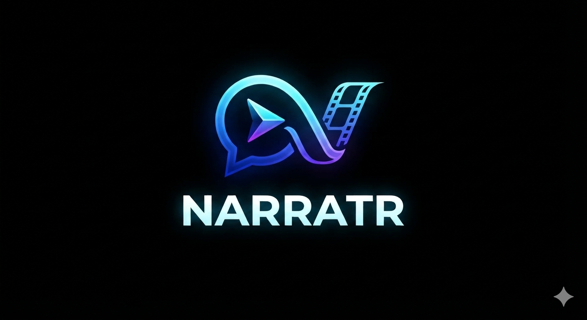

<p align="center">
  
</p>

<p align="center">
  <strong>Turn a document into a narrated video, locally.</strong><br>
  No API bills, nothing uploaded.
</p>

Point a Claude session at a Notion page or a markdown file and ask for a video.
Claude writes the script; your laptop renders it while you do something else.

---

## Requirements

- **macOS on Apple Silicon** — narration runs on MPS
- **[uv](https://docs.astral.sh/uv/)**, **ffmpeg**, **Node 20+**
- **Python 3.11.9–3.12** (uv installs it if missing)
- **~6 GB free** — 3.8 GB of model weights, 1.1 GB of Python environment

```sh
brew install uv ffmpeg node
```

## Setup

```sh
git clone <this-repo> && cd narratr
make setup
```

`make setup` syncs the environment from `pyproject.toml`, downloads the
Chatterbox Turbo weights into the shared HuggingFace cache, installs the
pre-commit hook, and finishes by running `doctor`. First run takes a few
minutes, mostly the weights.

A green `doctor` means the machine can render:

```
  ✓ python                  3.11.9
  ✓ torch                   2.6.0
  ✓ mps acceleration        available
  ✓ chatterbox watermarker  ok
  ✓ ffmpeg                  /opt/homebrew/bin/ffmpeg
  ✓ node                    /Users/you/.nvm/versions/node/v22.16.0/bin/node
  ✓ voice reference         1 sample(s)

  ✓ Ready
```

Then let Claude see the skill:

```sh
ln -s "$PWD/skill" ~/.claude/skills/narratr
```

Start a new Claude session for it to load.

## Use

**From Claude** — point it at a document and ask for a video. It writes
`scenes.json`, validates it, shows you a coverage report, and waits for your go
before spending any compute.

**Directly:**

```sh
uv run narratr doctor                        # is this machine ready
uv run narratr validate scenes.json          # schema + coverage, costs nothing
uv run narratr render scenes.json --detach   # returns a run id in ~1s
uv run narratr status                        # progress of the newest run
uv run narratr blocks <doc> --json           # leaf block ids for the ledger
```

Edits are cheap. Artifacts are content-addressed in a shared `store/`, keyed
separately for audio and picture, so a re-run only redoes what actually changed:

| Change | Cost |
|---|---|
| Nothing | ~1s |
| A diagram or some bullets | ~7s |
| One scene's narration | ~45s |
| Everything (cold) | ~2.5 min |

To iterate on a single scene without touching the rest:

```sh
uv run narratr render scenes.json --only the-flow
```

Repeatable, and it skips stitching so `video.mp4` is never left partial.

Runs land in `runs/<title> [DD-MM HH:MM AM/PM]/`. `narratr status` takes a name
or any prefix of one, and defaults to the most recent run.

`--detach` survives the terminal closing, the parent shell exiting, and the
Claude session ending. Runs are checkpointed per scene, so an interruption
costs one scene rather than the run — re-run the same command to resume.

Try it against the bundled example:

```sh
uv run narratr render examples/scenes.json
```

## Voice

`assets/voices/sample-01.wav` is the project voice. Point `voice.reference`
somewhere else to change it.

```json
"voice": { "reference": "assets/voices/sample-01.wav", "seed": 7, "speed": 0.92 }
```

**Speed defaults to 0.92** — a little slower than Chatterbox's natural pace,
which suits narration you follow rather than skim. Below 1 is slower; pitch is
unchanged either way.

Speed is keyed apart from narration, so trying a different one resamples what
already exists instead of regenerating it: about 40s for a six-scene clip
against two and a half minutes.

Chatterbox Turbo has no built-in voice of its own — it speaks only as the
reference clip, so that clip sets the character of every video.

## The title card

Every video opens with a four-second card: the mark, the document's title, and
`assets/intro.mp3`. It is built like a scene — rendered against a duration it is
told, audio padded to a whole number of frames — so assembly does not treat it
as a special case.

Replace either asset to rebrand. `assets/intro.mp3` sets the length of the card,
and `render/remotion/public/narratr-mark.png` is the image. The sting is
attenuated 8 dB on the way in, because it is mastered about eleven decibels
louder than the narration that follows it.

The card is keyed apart from the scenes, so changing it rebuilds four seconds
rather than the whole video.

## What it costs

**Nothing per video.** Claude runs on your existing subscription; everything
else is local.

The budget is wall clock, at roughly **twice the video's length** on an M4 Pro.
The bundled 6-scene example runs cold in about 2 minutes. Narration dominates
at rtf 1.33; rendering is 0.55, and speed, alignment and assembly are close to
free.

To keep the machine awake through a long run:

```sh
caffeinate -is uv run narratr render scenes.json
```

Note that `caffeinate` prevents idle sleep but **not lid-close sleep** unless an
external display is attached.

## Development

```sh
make test    # ruff format + lint, mypy, pytest
make fix     # auto-fix formatting and lint
make clean   # drop caches
make reset   # rebuild the environment from scratch (weights survive)
```

Run `make` on its own for the full target list.

## Status

Every stage works end to end. A run produces `runs/<id>/video.mp4` and
`captions.srt`.

| Stage | Measured on an M4 Pro |
|---|---|
| Script engine (Claude skill) | conversational |
| Narration (Chatterbox Turbo) | rtf 1.33 |
| Speed (ffmpeg atempo) | rtf 0.02 |
| Alignment (torchaudio forced) | rtf 0.03 |
| Scene render (Remotion) | rtf 0.55 |
| Assembly (FFmpeg) | ~1s |

The finished video opens on the title card and carries chapters — the card
first, then one per scene heading — with `captions.srt` beside it.

**Audio and picture are frame-exact.** Each scene's audio is padded to a whole
number of frames and the whole narration is encoded once, so scene boundaries
land within 0 ms of each other however long the video is.

## Troubleshooting

**`'NoneType' object is not callable` on model load** — `setuptools` 81 removed
`pkg_resources`, which Chatterbox's watermarker imports and whose ImportError it
swallows. The pin in `pyproject.toml` prevents this; `make reset` restores it.

**`doctor` reports `mps acceleration: CPU only`** — narration will be roughly 5×
slower. Check you are on Apple Silicon and that torch installed correctly.

**Weights re-downloading** — they live in `~/.cache/huggingface`, outside the
project. `make reset` does not touch them.

**A change to the renderer seems to do nothing** — video is keyed on the React
components, `mermaid.config.json` and `narratr/render.py`. Editing anything else
that affects the picture will reuse the cached video. Add the file to
`RENDERER_SOURCES` in `narratr/state.py`.

**Everything re-renders after an edit** — expected if you changed narration:
that invalidates the audio, its timings, and the picture, because a scene's
length comes from its audio. Changing only bullets or a diagram re-renders just
the video.

## Licence note

Remotion, which renders the scenes, is free for individuals and organizations
of up to 3 people. Above that it requires a paid Company License,
counted by headcount rather than by whether anything is sold — internal use at a
company counts. No account or licence key is needed for free use.

`render/CONTRACT.md` isolates the renderer so Motion Canvas (MIT) can replace it
if that becomes a problem.

## Design

See [docs/research-plan.md](docs/research-plan.md) for why each piece was chosen,
what was measured, and what is still uncertain.
