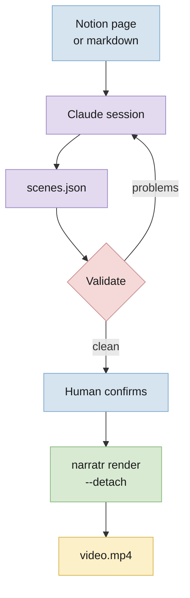
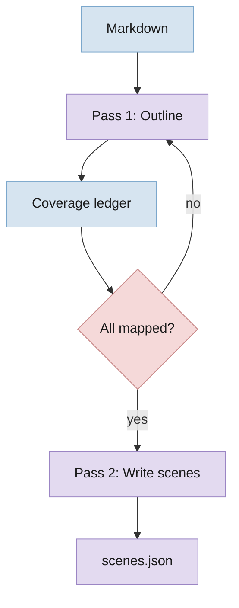
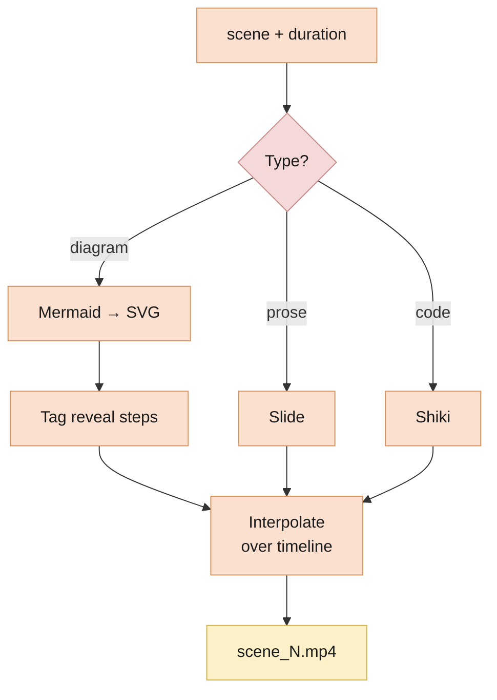
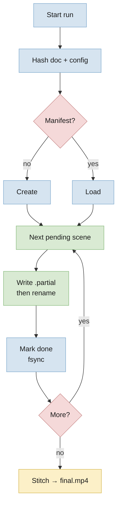
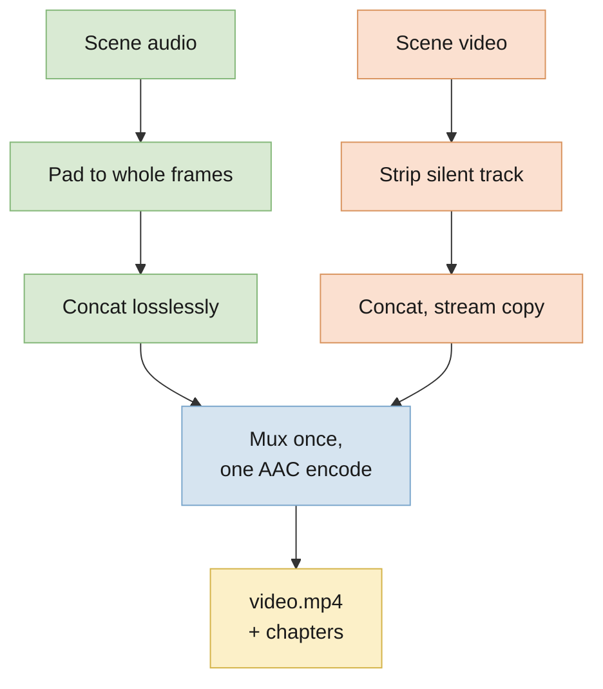

---
tags:
  - narratr
  - research
  - plan
---
# narratr — Research & Build Plan

**Date:** 2026-09-05 · **Status:** complete and in use; refinement only · **Scope:** personal tool, local, macOS on Apple Silicon

---

## BLUF

A Claude skill plus a local CLI. Claude reads a document and writes the script; your laptop does the rest, unattended.

**The stack:**

| Layer | Choice | Verdict |
|---|---|---|
| **Script + scene planning** | Claude, in-session, via the narratr skill | Build as a skill |
| **Narration** | Chatterbox Turbo, local | Build on OSS |
| **Word timings** | torchaudio forced alignment, local | Build on OSS |
| **Slides + diagram animation** | Remotion (React → video) | Build on OSS |
| **Diagram source** | Mermaid, rendered to SVG, revealed step-by-step | Build (~150 LOC) |
| **Playback speed** | ffmpeg `atempo`, after narration | Build on OSS |
| **Assembly** | FFmpeg, lossless concat + one encode | Buy (OSS) |

**Cost per video: $0.** Claude runs on the subscription that already powers your session. Everything else is local.

**The budget is wall clock:** about twice the video's length, most of it TTS. A two-minute clip costs about four minutes.

**Three decisions carry the design:**

1. **Audio-first.** Narration is generated first; the video timeline is derived from measured audio durations.
2. **Skill writes, CLI renders.** Claude produces `scenes.json` and stops. A long compute job does not belong in a conversation.
3. **Every stage is resumable.** A run must survive a closed lid and the session that started it.

---

## The Core Insight: Audio-First

Every doc-to-video project fails the same way — you build slides, then try to make narration fit them. Timing drift is unfixable and every edit re-breaks it.

Invert it. Narration is the master clock.

1. Claude writes the script, split into scenes.
2. TTS renders each scene and reports its exact duration.
3. The renderer is *told* the duration. It fits its animation into whatever it is given.

Sync stops being a problem *upstream* of assembly. It is not automatic: the plan originally claimed sync "becomes a non-problem", and that turned out to be wrong at the last stage. See [Assembly](#stage-5--assembly).

It also makes local TTS viable. Chatterbox drifts over long single passes and holds together over short ones. Scene-sized chunks are the natural unit of both the timeline and the model's competence.

---

## The Boundary That Matters

`scenes.json` is the contract. Everything before it needs judgment; everything after is deterministic compute that never touches a model.



**Claude does not run the pipeline.** It launches a detached process and reports a run id. Streaming forty scenes of TTS progress into a conversation burns context to say what one `status` call answers in a line.

**The source is whatever Claude can read.** A Notion page via MCP, a local file, pasted text. narratr has no Notion integration and needs none.

---

## Stage 1 — The Script Engine

Where "covers everything" is won or lost. Two passes, not one.



**Why two passes** — a single "turn this doc into a video" call silently drops material. Long docs get summarized, not covered. Splitting outline from prose lets you assert coverage mechanically.

**The coverage ledger is the FOMO cure.** Every leaf block gets an id. Pass 1 must map each one to a scene. `narratr validate` fails on any unmapped block, any mapping to a scene that does not exist, and any block that was invented. This runs before compute is spent and costs nothing.

**The block list must come from the document, not the author.** `narratr blocks <doc> --json` extracts it mechanically. If the same pass decides both what counts as a block and which blocks are covered, the gate is circular — anything skipped can simply be left off the list and validation still passes. This was a real hole, found by running the skill on this document.

Running the script engine inside the live session — rather than shelling out to `claude -p` — removes a whole category of problem. There is no subprocess to authenticate, no ambient config to pin, and no exposure to `--bare` becoming the default for `-p`. Claude is already the script engine.

---

## Stage 2 — Narration

**Chatterbox Turbo**, 350M params, MIT licence, on MPS.

### Measured on this machine

M4 Pro / 24 GB, real runs:

| Model | Load | Sustained rtf |
|---|---|---|
| Standard (0.5B) | 15–17s | 2.9–3.5 |
| **Turbo (350M)** | 75s | **1.0–1.35** |

`rtf` is seconds of compute per second of audio. Measured over a six-scene run, which matters: an earlier two-scene benchmark reported 1.59 and hid a 4× regression that only appears once memory pressure builds. **Benchmark six scenes or more, never two.**

### What this constrains

- **Turbo has no built-in voice.** It speaks only as the reference clip it is given. That clip's quality caps every video you make.
- **Pin the reference clip and the seed.** Both are conditioning inputs, and cross-scene consistency is the quality risk that matters.
- **Pin `setuptools<81`.** Chatterbox's watermarker imports `pkg_resources`, swallows the ImportError, and dies far away with `'NoneType' object is not callable`.
- **Weights are ~3.8 GB**, pulled once into the shared HuggingFace cache.
- **Release the MPS allocator cache between scenes.** Left alone it reserves 14.6 GB against 2.9 GB live, which over-commits a 24 GB machine and drives ~1M page-ins per generation. One `torch.mps.empty_cache()` per scene holds it near 3.6 GB and keeps rtf flat. Any future stage running a model on MPS needs the same.

### Speed

`voice.speed` resamples the narration with ffmpeg's `atempo`, which changes pace
without shifting pitch. It runs as its own stage between narration and
alignment, because word timings must be measured from whatever audio ships.

Keyed apart from narration on purpose: narration is the most expensive stage in
the pipeline and a resample is close to free, so trying a speed costs seconds
rather than a full re-narration. The picture depends on it too, since a scene's
length comes from the sped audio.

### Captions

Forced alignment, not transcription. The text is known exactly — it is what we asked Chatterbox to say — so `torchaudio`'s CTC aligner and the MMS_FA bundle line the words up against the audio directly.

That replaced WhisperX, which would have brought faster-whisper and CTranslate2 to transcribe speech we already have the script for. torchaudio was already a dependency. Measured at **rtf 0.03** — 73 seconds of audio aligned in 2 seconds, essentially free.

`torchaudio::forced_align` has no MPS kernel, so the emission is moved to CPU explicitly for that one call rather than setting `PYTORCH_ENABLE_MPS_FALLBACK`, which would silently send any unimplemented op to the CPU and hide the cost.

---

## Stage 3 — The Scene Renderer



**Palette.** Dark slate ground from [archify](https://github.com/tt-a1i/archify) — `#020617` with `#94a3b8` for secondary text and six 400-level accents. Colour separates rather than decorates: one accent per bullet so the eye tracks the reveal, and a rotation across diagram nodes keyed to the reveal beat, so nodes that arrive together share a colour.

**Five shapes, not one.** A sequence, a comparison and a list of properties were all rendering as the same vertical stack, which is why every slide looked alike. The renderer now has `flow` for sequences and `cards` for parallel things alongside `prose`, `diagram` and `code`, and `skill/SKILL.md` chooses between them by the shape of the content. The judgement is the skill's; the renderer only makes each shape possible.

**Icons are Lucide, resolved before the render.** ISC licensed, ~2,000 glyphs, stroke-based on a 24px grid and drawn with `currentColor`, so a glyph inherits `accent(i)` rather than fighting the palette. They resolve in `narratr/icons.py` and arrive as markup in props, the same path Mermaid and Shiki already take, which keeps the component synchronous. The accent bar on a bullet is gone — the icon took its place and its colour, because a coloured bar names nothing.

An icon name is invented by Claude, so it is validated in `narratr validate` with near misses, alongside the coverage gate. A name that silently fell back to no icon would degrade one slide in a long video and be found on playback. `narratr icons <word>` searches the pack so the skill looks a name up rather than guessing twice.

**The npm dependencies are part of the render key.** Lucide draws the icons and Mermaid draws the diagrams, so `render/remotion/package.json` joined `RENDERER_SOURCES`. Without it, bumping either left every cached video holding the old glyphs while the pipeline reported nothing to do — the third instance of that same bug.

**Diagram animation, concretely.** Mermaid emits an SVG where every node carries `id="<prefix>-flowchart-<ID>-<n>"` and every edge a `data-id`. The node *class* is deliberately not matched: Mermaid writes `node default` for a plain node and `icon-shape default` for one carrying an icon, so a `g.node` selector stops animating the moment a diagram uses icons — and an unmatched node falls back to visible, which every structural check passes. Claude emits a `revealSteps` array grouping those ids into beats. Remotion interpolates opacity per group across the scene's duration. No third-party service.

**Render per scene, concat after.** Remotion slows down on very long single compositions, so scene-sized renders are the safe unit regardless of total length. Per-scene output is also what makes a run resumable and what lets a single edited scene re-render alone.

**The renderer sits behind a contract** (`render/CONTRACT.md`): it receives one scene, its measured duration, and an output path. It knows nothing about TTS, alignment, or scene ordering. That boundary exists so Remotion can be replaced without touching anything upstream — see Risks.

---

## Stage 4 — Durability

Kick it off, walk away, come back to a finished video or a run that resumes exactly where it stopped.



### The four rules

- **Content-address every artifact, on three separate keys.** `audio_key` covers narration, reference clip, seed and model. `speech_key` adds playback speed. `video_key` adds the picture fields *and a digest of the renderer's own source*, because a component or an encoder flag changes the output as surely as a bullet does. Artifacts live in `store/`, outside any run directory, so editing one scene reuses everything else — across runs, not just within one.
- **Trust the filesystem over the manifest.** On load the manifest re-keys against the current spec and clears any entry whose file has gone. A manifest that claims work is done while the artifact is missing reports "nothing to do" and ships a stale video.
- **Atomic writes only.** Write a `.partial.wav` beside the target, then `rename()`. The temp name keeps its real extension — torchaudio infers the container from it, and a `.tmp` suffix breaks the write.
- **Commit after each scene, not each stage.** `fsync` the manifest on every transition. The unit of loss is one scene, roughly 90 seconds.
- **One process, many scenes.** Turbo costs 75 seconds to load. Never spawn per scene.

### Surviving the session and the lid

`narratr render --detach` forks with `start_new_session=True`, writes a run id, and returns in under a second. The run outlives the Claude session, the terminal, and the parent shell.

Sleep is the remaining gap:

```sh
caffeinate -is uv run narratr render scenes.json
```

**Closing the lid still sleeps the machine.** `caffeinate` prevents idle sleep, not lid-close sleep, unless an external display is attached. Run lid-open on AC power, or rely on the checkpointing and lose the scene in flight.

---

## Stage 5 — Assembly

The audio-first clock does its job all the way to the renderer. Assembly is
where it was quietly undone, and the fix is the least obvious thing in the
design.



### What went wrong

A finished video drifted progressively out of sync — audio landing 0, 120, 147,
221, 221, 229 ms late across six scenes. Linear in scene count, so a 34-scene
video would have ended over a second out. It read as "very slightly off, worse
toward the end", which is exactly what a linear accumulator feels like.

Two independent causes, both the same shape: **an AAC track longer than its
content, and a concat demuxer that advances by container duration.**

- **Audio.** Each scene was encoded to AAC separately. Every segment carried its
  own encoder priming, compensated by its own edit list — correct in isolation.
  `-c copy` cannot carry per-file edit lists, so from the second segment onward
  that priming became real audio.
- **Video.** Remotion writes a silent AAC track into every rendered scene, about
  50 ms longer than the picture. A container's duration is its longest stream,
  so concat inserted a gap at each join and the picture drifted late.

Fixing only the first moved the fault from audio to video rather than removing
it. Both had to go.

### The three rules

- **Pad each scene's audio to a whole number of frames.** The renderer rounds a
  scene to `round(seconds × fps)` frames; padding the audio to match makes the
  two exactly equal. Without it the residual is a per-scene coin flip of up to
  ±16.7 ms that a stream copy then bakes in.
- **Encode the narration once, over the whole timeline.** No per-segment priming
  can accumulate if there are no per-segment encodes.
- **Mute the video segments before concatenating.** The renderer's silent track
  is longer than its own picture; drop it rather than let it set the timeline.

Verified three ways: video excess 0.0000s, every picture cut within 0 ms of its
audio boundary, per-scene audio lag 0 ms. The assembled file is content-addressed
too, so an unchanged re-run copies rather than re-encoding.

### A note on how this was found

The original diagnosis — mine — was wrong. It measured per-scene durations,
found them fine, and never measured cumulative position in the assembled file.
A fresh debugging agent given only the symptom found it by cross-correlating
each narration against the shipped audio, and isolated the cause with two
controls: swapping segment audio to PCM, and re-encoding at concat.

The lesson is narrower than "get a second opinion": **aggregate measurements are
blind to accumulating error.** Total duration was correct throughout.

---

## Build vs Buy

| Layer | Decision | Reasoning |
|---|---|---|
| **Script engine** | **Build** as a skill | Nothing off-the-shelf does coverage-guaranteed chunking. Running it in-session removes the auth and reproducibility problems a subprocess would add. |
| **TTS** | **Build** — Chatterbox Turbo | Quality cleared the bar on a real listen; MIT; zero marginal cost. Benchmarked above. |
| **Alignment** | **Build** — torchaudio | Already a dependency; forced alignment beats transcribing text we already have. |
| **Slides** | **Build** on Remotion — ~~MARP~~ | MARP outputs *static* artifacts. Animating them means exporting frames and panning, which kills per-element reveals. |
| **Diagram animation** | **Build** — ~~FlowGif~~ | Closed SaaS, GIF/PNG export. A GIF cannot be timed against narration. |
| **Assembly** | **Buy** — FFmpeg | Lossless audio concat, one AAC encode, video stream-copied. Per-segment encoding is what caused the drift described below. |

**Ruled out for TTS:** ElevenLabs and Sarvam. The recurring cost bought nothing that could not be replaced locally.

**Ruled out for the LLM:** the Anthropic Messages API. It offers explicit cache control and determinism, but needs separately purchased API credits for a tool whose calls the subscription already covers.

---

## Cost

**Dollars: $0.** Electricity is rounding error.

### Wall clock is the real budget

Real-time factors, which scale to whatever length you make. All measured, none estimated.

| Stage | rtf | 74s clip |
|---|---|---|
| Script | — | conversational |
| **Narration** | **1.33** | ~97s |
| Speed | 0.02 | ~2s |
| Alignment | 0.03 | ~2s |
| Render | 0.55 | ~40s |
| Assembly | — | ~1s |
| **Total** | **~1.9** | **~2.5 min** |

Editing is far cheaper than a cold run, which is the number that actually
matters day to day:

| Change | Cost |
|---|---|
| Nothing | ~1s |
| A diagram or some bullets | ~7s |
| Playback speed | ~40s |
| One scene's narration | ~45s |
| Cold | ~2.5 min |

Rendering came in faster than realtime, against an estimate that was wrong by roughly 3×. 1080p30 has headroom; the planned fallback to 24fps and 1600×900 is not needed. Concurrency swept 4 to 12 on a 12-core machine: identical above 6, so Remotion's default needs no tuning.

**Work in short clips.** `examples/brief.scenes.json` is six scenes and runs cold in about two and a half minutes, which is the right unit for iterating. Content addressing means a single edited scene re-renders alone.

---

## Risks

- **Script quality is the whole product.** Voice and animation are solved. Whether the narration is worth watching is decided in the Pass-1/Pass-2 prompts. Budget most of the effort there.
- **Remotion needs a paid Company License above 3 people.** The threshold is headcount, not whether anything is sold, and internal use counts. Using narratr on a work laptop triggers it. Free use needs no account or licence key — this is a terms obligation, not an enforced one. The renderer contract exists so Motion Canvas (MIT) can replace it; the swap gets more expensive with every scene component written.
- **Cross-scene voice consistency was closed by judgement, not by test.** A six-scene clip sounded consistent on a real listen and the question was closed there. It has not been tested at forty scenes. Recorded so nobody mistakes a decision for a measurement.
- **Reveals are not cued to speech.** Bullets appear on an even schedule across 60% of the scene with no reference to when their words are spoken; measured drift between the two ran −3.0s to +2.0s. Not a defect in anything built, but the largest remaining gap between what the videos are and what they could be. The word timings needed to fix it are already produced and unused.
- **~~MPS performance is unexplained~~ — resolved.** The erratic figures were the MPS caching allocator over-committing memory and forcing the machine to swap. Releasing it per scene fixed it. What remains unexplained is the gap to a quoted 0.499 on a 4090, and that `PYTORCH_ENABLE_MPS_FALLBACK=1` still sends unsupported ops to CPU silently. Neither is currently costing anything.
- **Mermaid's SVG structure is not a public API.** Node ids and class names shift between versions. Pin the version and snapshot-test the selectors.

---

## Status

| Stage | State |
|---|---|
| Script engine | working; produced 34 scenes covering all 51 blocks this document had at the time |
| Schema + coverage gate | working; rejects dropped blocks, ghost scenes, over-long slides |
| Block extraction | working, mechanical |
| Narration | working, benchmarked; picks up from `store/`, not from the manifest |
| Playback speed | working, default 0.92 |
| Alignment | working, word timings + SRT |
| Scene render | working, prose / diagram / code, Shiki highlighting |
| Assembly | working, frame-exact, chapters + captions |
| Detached runs | working, survives the parent process |
| Single-scene iteration | working, `--only` |
| Silent-audio guard | working, fails below −80 dB |

A run produces `runs/<title> [DD-MM HH:MM AM/PM]/video.mp4` with chapters, plus
`captions.srt`.

---

## Next

Everything in the original plan is built, and the refinements that followed it
are done too. What is left is one design gap and one untested claim:

1. **Cue reveals to speech.** The largest remaining improvement — see Risks. The
   likely shape is an optional `cue` per bullet naming a phrase from that
   scene's narration, resolved against the word timings, falling back to today's
   even spacing when absent. Inferring the cue by matching text after the fact
   does not work: bullets are paraphrases, and a matcher found nothing usable
   for 5 of 18 elements.
2. **Run a long document.** 51 blocks worked once. Nothing longer has been
   tried — and this document has since grown to 75 leaf blocks, which is why
   `examples/research-plan.scenes.json` was deleted rather than kept. It still
   validated, because `source.block_ids` is carried inside the spec rather than
   re-derived: exactly the circularity `skill/SKILL.md` warns about. Regenerate
   it by pointing the skill at the document again.

---

## Sources

- Chatterbox benchmarks: measured in-session on M4 Pro / 24 GB, 2026-09-05.
- [Chatterbox repo](https://github.com/resemble-ai/chatterbox) · [Chatterbox Turbo](https://codersera.com/blog/chatterbox-turbo-run-and-install-locally-free-elevenlabs-alternative-2026/) · [Best open-source TTS 2026](https://findskill.ai/blog/best-open-source-tts-2026/)
- [Remotion licence FAQ](https://www.remotion.dev/docs/license/faq) — the 3-person threshold and the no-account-needed rule
- [Claude Code skills](https://code.claude.com/docs/en/skills) · [Plugins](https://code.claude.com/docs/en/plugins)
- [Mermaid: animated diagrams issue #3029](https://github.com/mermaid-js/mermaid/issues/3029)
