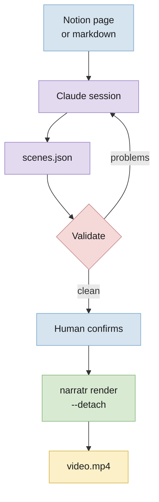
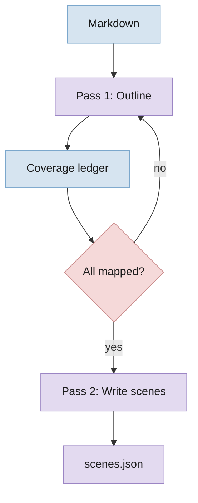
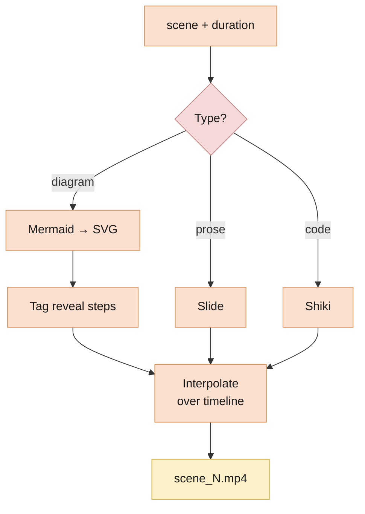
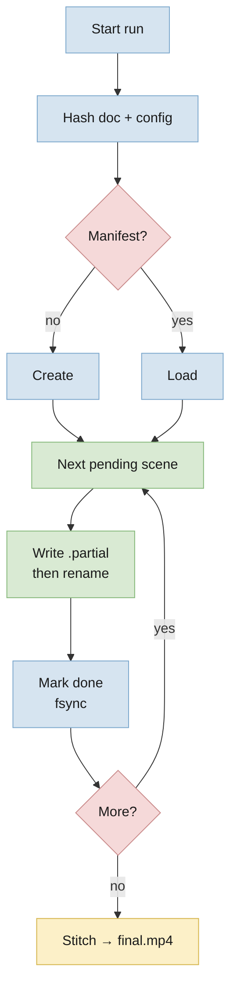

---
tags:
  - narratr
  - research
  - plan
---
# narratr — Research & Build Plan

**Date:** 2026-09-05 · **Status:** narration built and benchmarked; render pipeline not started · **Scope:** personal tool, local, macOS on Apple Silicon

---

## BLUF

A Claude skill plus a local CLI. Claude reads a document and writes the script; your laptop does the rest, unattended.

**The stack:**

| Layer | Choice | Verdict |
|---|---|---|
| **Script + scene planning** | Claude, in-session, via the narratr skill | Build as a skill |
| **Narration** | Chatterbox Turbo, local | Build on OSS |
| **Word timings** | WhisperX forced alignment, local | Build on OSS |
| **Slides + diagram animation** | Remotion (React → video) | Build on OSS |
| **Diagram source** | Mermaid, rendered to SVG, revealed step-by-step | Build (~150 LOC) |
| **Assembly** | FFmpeg concat demuxer | Buy (OSS) |

**Cost per video: $0.** Claude runs on the subscription that already powers your session. Everything else is local.

**The budget is wall clock:** ~2.5 hours for a 36-minute video, most of it TTS.

**Three decisions carry the design:**

1. **Audio-first.** Narration is generated first; the video timeline is derived from measured audio durations.
2. **Skill writes, CLI renders.** Claude produces `scenes.json` and stops. A 2.5-hour compute job does not belong in a conversation.
3. **Every stage is resumable.** A run must survive a closed lid and the session that started it.

---

## The Core Insight: Audio-First

Every doc-to-video project fails the same way — you build slides, then try to make narration fit them. Timing drift is unfixable and every edit re-breaks it.

Invert it. Narration is the master clock.

1. Claude writes the script, split into scenes.
2. TTS renders each scene and reports its exact duration.
3. The renderer is *told* the duration. It fits its animation into whatever it is given.

Sync becomes a non-problem, not a problem you solve.

It also makes local TTS viable. Chatterbox drifts over long single passes and holds together over short ones. Scene-sized chunks are the natural unit of both the timeline and the model's competence.

---

## The Boundary That Matters

`scenes.json` is the contract. Everything before it needs judgment; everything after is deterministic compute that never touches a model.



**Claude does not run the pipeline.** It launches a detached process and reports a run id. Streaming forty scenes of TTS progress into a conversation burns context to say what one `status` call answers in a line.

**The source is whatever Claude can read.** A Notion page via MCP, a local file, pasted text. narratr has no Notion integration and needs none.

---

## Stage 1 — The Script Engine

Where "covers everything" is won or lost. Two passes, not one.



**Why two passes** — a single "turn this doc into a video" call silently drops material. Long docs get summarized, not covered. Splitting outline from prose lets you assert coverage mechanically.

**The coverage ledger is the FOMO cure.** Every leaf block gets an id. Pass 1 must map each one to a scene. `narratr validate` fails on any unmapped block, any mapping to a scene that does not exist, and any block that was invented. This runs before compute is spent and costs nothing.

Running the script engine inside the live session — rather than shelling out to `claude -p` — removes a whole category of problem. There is no subprocess to authenticate, no ambient config to pin, and no exposure to `--bare` becoming the default for `-p`. Claude is already the script engine.

---

## Stage 2 — Narration

**Chatterbox Turbo**, 350M params, MIT licence, on MPS.

### Measured on this machine

M4 Pro / 24 GB, real runs:

| Model | Load | Warm rtf | Extrapolated to 36 min |
|---|---|---|---|
| Standard (0.5B) | 15–17s | 2.92–3.50 | ~160–216 min |
| **Turbo (350M)** | 75s | **1.59** | **~100 min** |

`rtf` is seconds of compute per second of audio. Variance on MPS is wide — the standard model swung 40% between identical runs, and Turbo has been observed between 1.25 and 5.61 on individual scenes. Plan against **~100 minutes**.

### What this constrains

- **Turbo has no built-in voice.** It speaks only as the reference clip it is given. That clip's quality caps every video you make.
- **Pin the reference clip and the seed.** Both are conditioning inputs, and cross-scene consistency is the quality risk that matters.
- **Pin `setuptools<81`.** Chatterbox's watermarker imports `pkg_resources`, swallows the ImportError, and dies far away with `'NoneType' object is not callable`.
- **Weights are ~3.8 GB**, pulled once into the shared HuggingFace cache.

### Captions

WhisperX forced alignment over the generated audio. Local, free, word-level, and indifferent to which TTS produced the audio.

---

## Stage 3 — The Scene Renderer



**Diagram animation, concretely.** Mermaid emits an SVG where every node is `g.node[id]` and every edge is `g.edgePath`. Claude emits a `revealSteps` array grouping those ids into beats. Remotion interpolates opacity per group across the scene's duration. No third-party service.

**Render per scene, concat after.** Remotion slows down on very long single compositions. Forty 50-second renders beat one 36-minute render, and per-scene output is what makes the run resumable.

**The renderer sits behind a contract** (`render/CONTRACT.md`): it receives one scene, its measured duration, and an output path. It knows nothing about TTS, alignment, or scene ordering. That boundary exists so Remotion can be replaced without touching anything upstream — see Risks.

---

## Stage 4 — Durability

Kick it off, walk away, come back to a finished video or a run that resumes exactly where it stopped.



### The four rules

- **Content-address every artifact.** Each scene is keyed on `hash(narration + voice_ref + seed + model)`. A matching file means skip. Resume and incremental re-render fall out of one mechanism: edit one scene, only that scene re-runs.
- **Atomic writes only.** Write a `.partial.wav` beside the target, then `rename()`. The temp name keeps its real extension — torchaudio infers the container from it, and a `.tmp` suffix breaks the write.
- **Commit after each scene, not each stage.** `fsync` the manifest on every transition. The unit of loss is one scene, roughly 90 seconds.
- **One process, many scenes.** Turbo costs 75 seconds to load. Never spawn per scene.

### Surviving the session and the lid

`narratr render --detach` forks with `start_new_session=True`, writes a run id, and returns in under a second. The run outlives the Claude session, the terminal, and the parent shell.

Sleep is the remaining gap:

```sh
caffeinate -is uv run narratr render scenes.json
```

**Closing the lid still sleeps the machine.** `caffeinate` prevents idle sleep, not lid-close sleep, unless an external display is attached. Run lid-open on AC power, or rely on the checkpointing and lose the scene in flight.

---

## Build vs Buy

| Layer | Decision | Reasoning |
|---|---|---|
| **Script engine** | **Build** as a skill | Nothing off-the-shelf does coverage-guaranteed chunking. Running it in-session removes the auth and reproducibility problems a subprocess would add. |
| **TTS** | **Build** — Chatterbox Turbo | Quality cleared the bar on a real listen; MIT; zero marginal cost. Benchmarked above. |
| **Alignment** | **Build** — WhisperX | Decouples captions from any TTS vendor. |
| **Slides** | **Build** on Remotion — ~~MARP~~ | MARP outputs *static* artifacts. Animating them means exporting frames and panning, which kills per-element reveals. |
| **Diagram animation** | **Build** — ~~FlowGif~~ | Closed SaaS, GIF/PNG export. A GIF cannot be timed against narration. |
| **Assembly** | **Buy** — FFmpeg | `concat` demuxer with stream copy. Milliseconds, no re-encode. |

**Ruled out for TTS:** ElevenLabs and Sarvam. The recurring cost bought nothing that could not be replaced locally.

**Ruled out for the LLM:** the Anthropic Messages API. It offers explicit cache control and determinism, but needs separately purchased API credits for a tool whose calls the subscription already covers.

---

## Cost

**Dollars: $0.** Electricity for a 2.5-hour run is under two cents.

### Wall clock is the real budget

| Stage | Time | Basis |
|---|---|---|
| Script | minutes | In-session, conversational |
| **Narration** | **~100 min** | Measured, rtf 1.59 |
| Alignment | ~10 min | Estimate, unmeasured |
| Render | 30–60 min | Estimate, unmeasured |
| Stitch | seconds | Stream copy |
| **Total** | **~2.5 h** | |

Only narration is measured. Benchmark the render on day one with `npx remotion benchmark`; if it is worse than expected, drop to 24fps and 1600×900 before changing anything architectural.

**Drafting does not cost 2.5 hours.** Content-addressing means a single edited scene re-renders alone, in minutes.

---

## Risks

- **Script quality is the whole product.** Voice and animation are solved. Whether the narration is worth 36 minutes of attention is decided in the Pass-1/Pass-2 prompts. Budget most of the effort there.
- **Remotion needs a paid Company License above 3 people.** The threshold is headcount, not whether anything is sold, and internal use counts. Using narratr on a work laptop triggers it. Free use needs no account or licence key — this is a terms obligation, not an enforced one. The renderer contract exists so Motion Canvas (MIT) can replace it; the swap gets more expensive with every scene component written.
- **Cross-scene voice consistency is unproven.** Longest test so far is three scenes. Whether scene 40 still sounds like scene 3 is the open quality question and the failure mode local TTS is most prone to.
- **The reference clip is a single point of failure.** Turbo has no fallback voice.
- **MPS performance is unexplained and erratic.** An rtf of 1.59 against a quoted 0.499 on a 4090 is wider than hardware explains, and per-scene figures have ranged 1.25 to 5.61. `PYTORCH_ENABLE_MPS_FALLBACK=1` sends unsupported ops to CPU silently.
- **Mermaid's SVG structure is not a public API.** Node ids and class names shift between versions. Pin the version and snapshot-test the selectors.

---

## Status

| Stage | State |
|---|---|
| Script engine | `skill/SKILL.md` written, unexercised on a real document |
| Schema + coverage gate | built, 8 tests passing |
| Narration | **working**, benchmarked, resumable |
| Detached runs | **working**, verified surviving the parent process |
| Alignment | not built |
| Scene render | not built |
| Stitch | not built |

`narratr render` runs narration, then stops visibly at the first unbuilt stage and leaves completed audio in `runs/<id>/audio/`.

---

## Next

1. **Record a proper reference clip.** Ten clean seconds. Everything inherits it.
2. **Run 20 scenes of a real document and listen straight through.** The cheapest test of the one risk that could still sink the TTS choice.
3. **Build alignment.** WhisperX over the existing audio; smallest remaining stage.
4. **Benchmark Remotion before building scene components.** If render time is bad, that changes the design; if the licence forces a swap, better to know before writing them.
5. **Then** the renderer and stitch.

---

## Sources

- Chatterbox benchmarks: measured in-session on M4 Pro / 24 GB, 2026-09-05.
- [Chatterbox repo](https://github.com/resemble-ai/chatterbox) · [Chatterbox Turbo](https://codersera.com/blog/chatterbox-turbo-run-and-install-locally-free-elevenlabs-alternative-2026/) · [Best open-source TTS 2026](https://findskill.ai/blog/best-open-source-tts-2026/)
- [Remotion licence FAQ](https://www.remotion.dev/docs/license/faq) — the 3-person threshold and the no-account-needed rule
- [Claude Code skills](https://code.claude.com/docs/en/skills) · [Plugins](https://code.claude.com/docs/en/plugins)
- [Mermaid: animated diagrams issue #3029](https://github.com/mermaid-js/mermaid/issues/3029)
